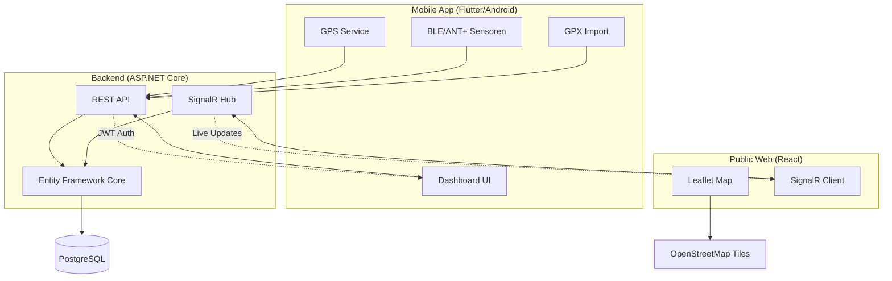

# Live-Tracking-Plattform für Ausdauersportler

## Projektübersicht

Eine Echtzeit-Tracking-Plattform für Fahrradfahrer und andere Ausdauersportler mit:
- **Android-App (Flutter)**: GPS-Tracking, Sensor-Anbindung (BLE/ANT+), GPX-Import
- **Öffentliche Webseite (React)**: Live-Karte ohne Login-Pflicht
- **ASP.NET Core Backend**: REST API + SignalR für Echtzeit-Updates
- **PostgreSQL**: Relationale Datenbank

## Architektur



## Technischer Stack

### Mobile App
- **Flutter 3.x** (Dart)
- BLE & ANT+ für Sensoren
- GPS-Tracking mit Geolocator
- GPX-Parser
- JWT Authentication

### Public Web
- **React 18** mit TypeScript
- **Vite** als Build-Tool
- **Leaflet** für Kartendarstellung
- **SignalR Client** für Live-Updates
- Responsive Design (Mobile-First)

### Backend
- **ASP.NET Core 8.0** Web API
- **Entity Framework Core 8.0**
- **SignalR** für Echtzeit-Kommunikation
- **JWT** Access & Refresh Tokens
- **Swagger/OpenAPI** Dokumentation

### Datenbank
- **PostgreSQL 16**
- Migrations mit EF Core

### Deployment
- **Docker Compose** für lokale Entwicklung
- Backend & PostgreSQL containerisiert

## Voraussetzungen

### Allgemein
- Git
- Docker Desktop
- .NET 8.0 SDK

### Für Android-App
- Flutter SDK (3.x oder höher)
- Android Studio mit SDK 33+
- Android-Gerät oder Emulator

### Für Web-Frontend
- Node.js 20+
- npm oder yarn

## Schnellstart

### 1. Repository klonen
```bash
git clone <repository-url>
cd live-tracking-platform
```

### 2. Backend & Datenbank starten
```bash
# Docker Compose starten
docker-compose up -d

# Warten bis PostgreSQL bereit ist (ca. 10 Sekunden)

# Datenbank-Migrationen ausführen
dotnet ef database update --project backend/LiveTracking.Infrastructure --startup-project backend/LiveTracking.Api

# Backend läuft auf: http://localhost:5000
# Swagger UI: http://localhost:5000/swagger
```

### 3. Public Web starten
```bash
cd apps/public_web
npm install
npm run dev

# Frontend läuft auf: http://localhost:5173
```

### 4. Flutter-App (Android)
```bash
cd apps/mobile_flutter
flutter pub get
flutter run

# Wähle ein Android-Gerät oder starte einen Emulator
```

## Lokale URLs

| Service | URL | Beschreibung |
|---------|-----|--------------|
| Backend API | http://localhost:5000 | REST API Endpoints |
| Swagger UI | http://localhost:5000/swagger | API Dokumentation |
| SignalR Hub | http://localhost:5000/hubs/live-tracking | WebSocket Verbindung |
| Public Web | http://localhost:5173 | Öffentliche Karte |
| PostgreSQL | localhost:5432 | Datenbank (User: postgres, PW: postgres) |

## Demo-Zugangsdaten

### Backend Seed-Daten
Nach der ersten Migration werden automatisch Demo-Nutzer angelegt:

| E-Mail | Passwort | Rolle |
|--------|----------|-------|
| demo@velopulse.app | Demo123! | User |
| anna@example.com | Demo123! | User |
| max@example.com | Demo123! | User |

### Demo-Modus

Der Backend-Background-Service simuliert automatisch 3 aktive Live-Sessions mit:
- Beweglichen Positionen
- Herzfrequenz-Daten (120-180 bpm)
- Geschwindigkeit (15-35 km/h)
- Fortschritts-Updates

**Aktivierung**: Läuft automatisch in Development-Umgebung

## Konfiguration

### Tile-Server (Karten)

Die Anwendung verwendet OpenStreetMap-kompatible Tile-Server. Standard-Konfiguration:

**Public Web** (`apps/public_web/.env`):
```env
VITE_TILE_URL=https://{s}.tile.openstreetmap.org/{z}/{x}/{y}.png
VITE_TILE_ATTRIBUTION=© OpenStreetMap contributors
```

**⚠️ Wichtig für Produktion:**
Die öffentlichen OSM-Tile-Server haben [Usage Policies](https://operations.osmfoundation.org/policies/tiles/). Für produktiven Betrieb:
- Eigenen Tile-Server hosten (z.B. mit [OpenMapTiles](https://openmaptiles.org/))
- Kommerziellen Anbieter nutzen (MapBox, Thunderforest, Stadia Maps)
- Tile-Caching implementieren

### Backend-Umgebungsvariablen

`backend/LiveTracking.Api/appsettings.json`:
```json
{
  "ConnectionStrings": {
    "DefaultConnection": "Host=localhost;Database=livetracking;Username=postgres;Password=postgres"
  },
  "Jwt": {
    "Secret": "your-secret-key-min-32-chars",
    "Issuer": "LiveTrackingApi",
    "Audience": "LiveTrackingClients",
    "AccessTokenExpirationMinutes": 15,
    "RefreshTokenExpirationDays": 30
  }
}
```

## Android-Berechtigungen

Die Flutter-App benötigt folgende Berechtigungen (siehe `docs/android-permissions.md`):

### GPS-Tracking
- `ACCESS_FINE_LOCATION`
- `ACCESS_COARSE_LOCATION`
- `ACCESS_BACKGROUND_LOCATION` (für Tracking im Hintergrund)

### Bluetooth-Sensoren
- `BLUETOOTH_SCAN`
- `BLUETOOTH_CONNECT`
- `BLUETOOTH_ADMIN` (Legacy)

### ANT+ (optional)
- Keine zusätzlichen Permissions erforderlich
- Prüfung der ANT+ Radio Service Verfügbarkeit zur Laufzeit

## BLE-Integration

Die App implementiert standardisierte GATT-Services für Fitness-Sensoren:

- **Heart Rate Service** (0x180D): Herzfrequenz
- **Speed & Cadence Service** (0x1816): Geschwindigkeit & Trittfrequenz
- **Cycling Power Service** (0x1818): Leistungsmesser

Mock-Adapter für Entwicklung ohne physische Sensoren verfügbar.

## ANT+-Integration

**Status**: Vorbereitet, aber nicht vollständig implementiert

ANT+ erfordert:
1. ANT+ Radio Service App (Google Play)
2. ANT+-fähige Hardware
3. Native Android-Implementation (Platform Channel vorbereitet)

Siehe `docs/ant-plus-integration.md` für Details.

## Bekannte Einschränkungen (MVP)

### Android-App
- ❌ Kein Background-Tracking (Foreground Service nicht implementiert)
- ❌ ANT+ nur als Schnittstelle vorbereitet, keine funktionale Implementation
- ❌ Keine Offline-Synchronisation
- ❌ Profilbilder werden noch nicht gespeichert
- ⚠️ Mock-Sensoren simulieren Daten, BLE-Adapter ist Grundgerüst

### Backend
- ❌ Keine E-Mail-Verifikation
- ❌ Kein Passwort-Zurücksetzen
- ❌ Keine Rate-Limiting
- ❌ Live-Snapshots werden nicht automatisch gelöscht (Archivierung fehlt)

### Public Web
- ❌ Keine erweiterte Filter-/Suchfunktion
- ❌ Keine Route-Vorschau vor Start
- ⚠️ Performance bei >50 gleichzeitigen Live-Sessions nicht getestet

### Allgemein
- ❌ Keine DSGVO-Compliance-Prüfung
- ❌ Keine Höhendaten-Service-Integration
- ❌ Keine App-Store-Releases
- ❌ Keine CI/CD-Pipeline

## Nächste Schritte

### Kurzfristig (MVP → Beta)
1. **Background-Tracking**: Android Foreground Service implementieren
2. **BLE-Adapter**: Vollständige GATT-Service-Implementation
3. **Offline-Support**: Queue für verzögerte API-Calls
4. **Image-Upload**: Profilbilder speichern und ausliefern
5. **E-Mail-Verification**: Token-basierte Bestätigung

### Mittelfristig
6. **ANT+**: Native Android-Integration mit ANT+ SDK
7. **Höhendaten-Service**: SRTM oder Open-Elevation API
8. **Route-Vorschau**: Karte vor Tour-Start
9. **Statistiken**: Auswertung abgeschlossener Activities
10. **Freundesliste**: Private Sessions für Freunde freigeben

### Langfristig
11. **iOS-App**: Flutter-Portierung mit CoreBluetooth
12. **Soziale Features**: Kommentare, Likes, Follower
13. **Gamification**: Achievements, Bestenlisten
14. **Export**: GPX/FIT-Export abgeschlossener Touren
15. **DSGVO-Compliance**: Datenlöschung, Datenexport, Consent-Management

## Dokumentation

- [Architektur](docs/architecture.md) - Detaillierte Systemarchitektur
- [API](docs/api.md) - REST API & SignalR Endpunkte
- [Android Permissions](docs/android-permissions.md) - Berechtigungsmanagement
- [ANT+ Integration](docs/ant-plus-integration.md) - ANT+ Sensor-Protokoll
- [Accessibility](docs/accessibility.md) - Barrierefreiheit

## Datenbankmigrationen

### Neue Migration erstellen
```bash
dotnet ef migrations add <MigrationName> \
  --project backend/LiveTracking.Infrastructure \
  --startup-project backend/LiveTracking.Api
```

### Migration anwenden
```bash
dotnet ef database update \
  --project backend/LiveTracking.Infrastructure \
  --startup-project backend/LiveTracking.Api
```

### Migration entfernen
```bash
dotnet ef migrations remove \
  --project backend/LiveTracking.Infrastructure \
  --startup-project backend/LiveTracking.Api
```

## Tests ausführen

### Backend-Tests
```bash
dotnet test
```

### Flutter-Tests
```bash
cd apps/mobile_flutter
flutter test
flutter analyze
```

### Web-Frontend
```bash
cd apps/public_web
npm test
npm run lint
```

## Build für Produktion

### Backend (Docker)
```bash
docker build -t livetracking-backend -f backend/LiveTracking.Api/Dockerfile .
```

### Flutter (Android APK)
```bash
cd apps/mobile_flutter
flutter build apk --release
# Output: build/app/outputs/flutter-apk/app-release.apk
```

### Web-Frontend
```bash
cd apps/public_web
npm run build
# Output: dist/
```

## Lizenz

MIT License (siehe LICENSE-Datei)

## Kontakt & Support

Bei Fragen oder Problemen:
- GitHub Issues: <repository-url>/issues
- E-Mail: support@velopulse.app (Platzhalter)

---

**Status**: MVP - Minimally Viable Product  
**Version**: 0.1.0  
**Letztes Update**: 2026-06-12
